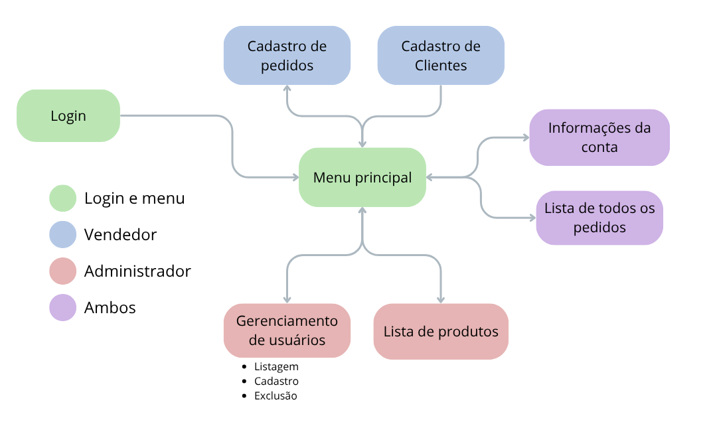

# 📱 Interface Web para a API de Gerenciamento de Pedidos
### Equipe
- Enzo Daniel Abreu
- Gabriel da Silva Freitas
- José Carlos Pereira Neto
- Lucas Paulino Gomes
- Thierry Antonello Pengo

> Esse website é parte de um projeto maior. Para mais informações, leia o README do [repositório da API](https://github.com/aspiringluke/Projeto-Integrado-3).

## ⚙ Informações técnicas
Todo o website foi desenvolvido sem frameworks, utilizando apenas HTML5, CSS3 e JavaScript. Ele está hospedado numa plataforma web chamada **Vercel**, uma PaaS que oferece hospedagem de websites e nos livra da necessidade de gerenciar a infraestrutura.

Para obter uma cópia dos arquivos, pode tanto baixar como zip no botão **Code** verde, ou clonar o repositório:
```sh
git clone https://github.com/aspiringluke/Projeto-Integrado-3
```

## 🧱 A estrutura
Aqui abaixo está um diagrama com as telas e a navegação. As telas são separadas pelo nível/função do usuário (vendedor ou admin), identificadas por cores.

